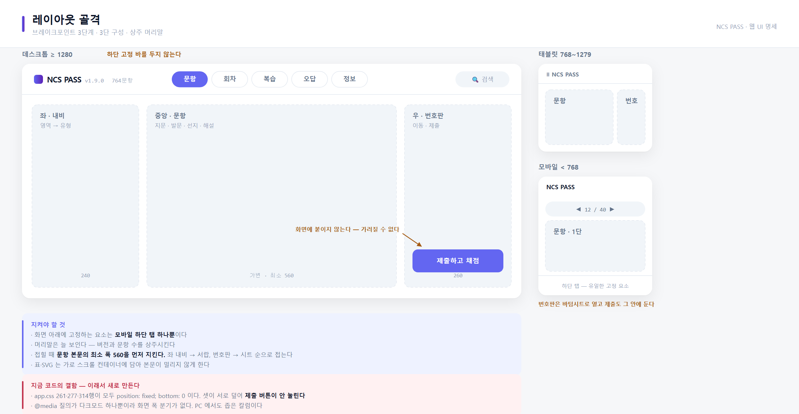
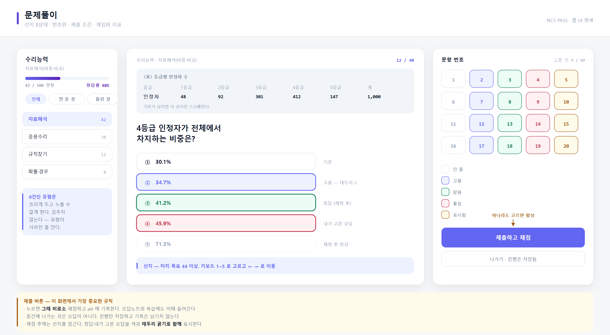
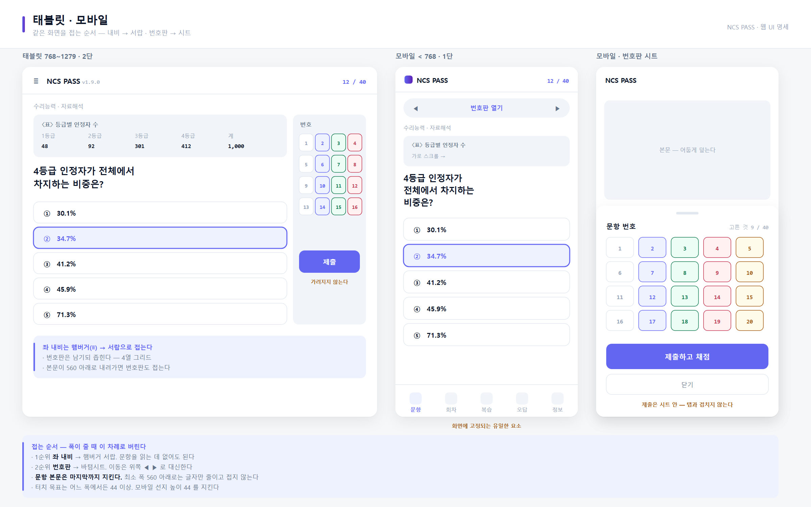

# 프로젝트 명세서

NCS PASS — 공기업 필기시험 대비 문항 제작·학습 시스템

### 문서 정보

| 항목 | 내용 |
|---|---|
| 프로젝트명 | NCS PASS — 후기 기반 문항 제작 파이프라인 · 학습 앱 |
| 구성 | 1인 개발 (기획·집필·도구·앱·배포 전 과정) |
| 개발 기간 | 2026.07 ~ 2026.08 (진행 중) |
| 문서 버전 | **v1.1 (2026.08.18)** — 이 문서의 원본은 `docs/PROJECT_SPEC.md` 다 |
| 배포 주소 | 웹 `https://supergangy.github.io/ncs-exam-app/` · 앱 GitHub Releases (APK) |
| 저장소 | `supergangy/ncs-exam` (비공개, 파이프라인) · `supergangy/ncs-exam-app` (공개, 배포본) |

### v1.0 에서 달라진 것

| 무엇 | 내용 |
|---|---|
| 문항 | 740 → **764** (대인관계 12 · 자기개발 12 신설 — 없던 두 영역) |
| 정답 분포 | 실측(5지선다 420문항)에 맞춰 정렬. **선지 오름차순 위반 18 → 0** |
| 법령 | 건보 5회차 41~45번을 **실제 조문**으로 교체 + 인용 대조 도구 |
| 배포 | 배포본이 로컬과 벌어졌는지 재는 도구 신설 (실제로 540에서 멈춰 있었다) |
| 웹 UI | **전면 재제작 결정** — React + Vite · 3단 레이아웃 · UI 명세 도면 3장 |
| 문서 | 명세서를 HTML 에서 **Markdown 단일 진실**로 옮기고 PDF 는 도구로 굽는다 |

---

## 1. 프로젝트 개요

### 1.1 배경 및 목적

공기업 NCS 필기시험은 기출문제가 공개되지 않는다. 응시자는 시판 문제집에 의존하는데, 그 문제집은 **어느 기관이 무엇을 어떻게 내는지에 대한 근거 없이** 일반적인 유형만 반복한다. 대행사가 바뀌면 시험 성격이 통째로 달라지는데도 문제집은 그대로다.

본 프로젝트는 **공개된 필기후기와 시행 자료를 데이터로 삼아** 기관별 출제 경향을 측정하고, 그 격차가 큰 곳부터 문항을 만들어 오프라인 앱으로 배포하는 시스템이다. 「감으로 만든 문제집」이 아니라 **근거를 남기는 문항 제작**이 목표다.

### 1.2 프로젝트 목표

| 구분 | 목표 |
|---|---|
| 콘텐츠 | 기관별 출제 경향에 맞춘 NCS·전산직 문항 은행, 실전 회차(봉투모의고사) |
| 근거 | 후기 4,410건을 분류·집계해 **후기 언급 점유율 대 은행 보유 비중**의 격차를 산출, 문항마다 출제 근거 기록 |
| 검증 | 정답을 **사람이 아니라 코드가 다시 계산**해 대조, 집필 규칙 위반을 기계로 차단 |
| 배포 | 완전 오프라인 학습 앱(Android) + 웹앱, 같은 데이터로 두 판을 동시에 유지 |

### 1.3 개발 범위

| 포함(In Scope) | 제외(Out of Scope) |
|---|---|
| 후기 수집·분류 도구, 출제 경향 분석 | 타사 기출문제 수집·재배포 |
| 문항 은행(Python 원본) · 회차 제작 | 로그인·회원 관리 |
| 집필 규칙 자동 검사 | 서버·DB (콘텐츠가 저장소 안에 있다) |
| 정답 재계산 검증기 | 광고·구독 결제 |
| PDF 3종 출력(문제·해설·출제이유서) | iOS 앱 |
| 학습 앱 · 웹앱 · APK 자동 빌드 | 실시간 동기화·클라우드 백업 |

> **제외 이유가 곧 설계 원칙이다.** 남의 기출을 **보여 주는** 쪽이 아니라 문항을 **만드는** 쪽이므로 서버가 필요 없다. 콘텐츠 전체가 저장소에 있고 앱은 그것을 번들해 오프라인으로 돈다.

### 1.4 구성 요소와 역할

1인 개발이므로 사람 대신 **파이프라인의 각 층**을 적는다.

| 층 | 위치 | 담당 |
|---|---|---|
| 근거 | `reviews/` | 후기 수집·중복 제거·분류, 기관별 경향 집계 |
| 콘텐츠 | `bank/` `rounds/` | 문항 은행(영역별) · 실전 회차(기관별) |
| 검증 | `tools/` | 규칙 검사·정답 재계산·법령 인용 대조·정답 분포 조정 |
| 산출 | `build.py` `templates/` | HTML → Chrome → PDF 3종, 지면 배치 |
| 배포 | `app/` `mobile/` `.github/` | 웹앱 · 학습 앱 · APK 자동 빌드 |

---

## 2. 시스템 아키텍처

### 2.1 파이프라인 구성

서버가 없으므로 계층은 네트워크가 아니라 **데이터가 흐르는 단계**로 나뉜다.

```
  [근거]          [콘텐츠]           [검증]              [산출]         [배포]

reviews/db.json   bank/_common/     selfcheck.py       build.py       app/ ─► Pages
 (후기 4,410) ──► bank/seoul_metro/ verify_ncs.py  ──► └─ Chrome      └─ bank.json
      │          rounds/r1~r6/      verify_cs.py       headless       mobile/ ─► Actions
      │               │             law_text.py          │             └─ assets  └─ APK
      └─ report.py    └─ qtypes.py  reorder_choices.py   ├─ 문제.pdf        │
         gap.py         (유형 어휘)  export_bank.py      ├─ 해설.pdf   Releases
         (격차 산출)                deploy_check.py     └─ 출제이유.pdf
```

> **설계 의도:** 각 단계가 **파일로만** 이어진다. 데이터베이스도 API 도 없으므로 어느 단계든 따로 돌려 볼 수 있고, 결과가 `git diff` 로 드러난다. 검증 도구가 콘텐츠를 읽기만 하는 것이 아니라 **고치기도** 한다는 점이 특징이다(정답 분포 조정, 선지 정렬).

### 2.2 데이터 흐름과 통과 조건

| 단계 | 입력 → 출력 | 통과 조건 |
|---|---|---|
| 근거 | 후기 원문 → `db.json`(분류 결과) | 원문은 저장하지 않는다 · 중복은 `content_sig` 로 제거 |
| 집필 | 경향 분석 → 문항 `dict` | 문항마다 출제 근거(`why`) 네 칸 필수 |
| 검사 | 문항 → 지적 목록 | **치명 0건**이어야 다음 단계로 간다 |
| 재계산 | 문항 → 계산값 대조 | 불일치 0건 (계산형 전수) |
| 산출 | 문항 → PDF · JSON | 유형 어휘 밖 값이 있으면 **중단** |
| 배포 | JSON → 웹 · APK | CI 검사 통과 후에만 굽는다 |

### 2.3 검증 도구 설계

| 도구 | 무엇을 막나 | 어떻게 |
|---|---|---|
| `selfcheck.py` | 집필 규칙 위반 | 걸러낼 표현 24종 · 문장 100자 · 선지 길이 편차 · 발문 중복 · 허용 밖 HTML · **정답 분포와 연속** · 조합형 최소 판정 수(전수 탐색) |
| `verify_ncs.py` `verify_cs.py` | 정답이 틀린 문항 | 표·규정에서 **독립적으로 다시 계산**해 문항의 답과 대조 |
| `law_text.py` | 법령 조문 왜곡 | 인용문을 원문과 대조 — 공백을 지우고 찾으므로 **한 글자만 달라도** 걸린다 |
| `reorder_choices.py` | 정답 위치 쏠림 | 선지·단평·정답·**검증기 배치람다**를 함께 옮긴다. `--sort` 로 수치 선지를 값 순으로 정렬 |
| `export_bank.py` | 앱에서 터질 데이터 | 정답 범위·선지 수·id 중복·빈 발문, **수치 선지 오름차순** |
| `deploy_check.py` | 배포본이 뒤처지는 것 | 로컬과 배포본의 문항 수·영역별 차이·캐시 버전을 잰다 |

> **핵심:** 화면을 볼 수 없는 개발 환경(Windows·한글 사용자명)이라 **눈으로 확인할 수 없는 것을 코드로 대신 본다.** 앱 직렬화를 프레임워크 밖으로 빼 순수 Dart 검사기로 왕복 검증하고, PDF 는 지면 채움률을 측정해 넘침을 잡는다.

### 2.4 배포 구조

| 대상 | 경로 | 방식 |
|---|---|---|
| 웹 | `app/` → 공개 저장소 | 산출물만 옮겨 GitHub Pages. 매 배포마다 새로 편다. `sw.js` 캐시 버전을 올려야 갱신된다 |
| 앱(APK) | `mobile/` → Actions → Releases | 태그를 밀면 굽는다. 개발 PC 는 Smart App Control 이 셰이더 컴파일러를 막아 **러너에서만** 빌드된다 |
| PDF | `out/<회차>/` | 로컬 산출. 문제·해설·출제이유서 3종 |

> **웹과 APK 는 항상 같이 배포한다.** 한쪽만 올리면 조용히 벌어진다 — 실제로 배포본이 540문항에서 멈춰 있는데 로컬은 764였고, 커밋 기록만으로는 알 수 없었다. 그래서 `deploy_check.py` 를 배포 앞에 세웠다.

### 2.5 기술 스택

| 구분 | 기술 |
|---|---|
| 콘텐츠·도구 | Python 3.13 (표준 라이브러리 중심 · `ast` 로 소스 편집) |
| 문서 렌더 | Markdown → HTML → Chrome `--headless --print-to-pdf` |
| 앱 | Flutter 3.44 / Dart · `flutter_html` · `printing` · `file_picker` · SQLite |
| 웹 (현행) | 순수 HTML·CSS·JS + Service Worker |
| 웹 (차기) | **React + Vite** — 2.6절 |
| CI | GitHub Actions (검사 잡 + 태그 시 빌드 잡) |

### 2.6 웹 UI 재제작 (v1.1 신설)

현행 웹은 **구조적 결함**이 있어 고치는 대신 새로 만든다.

| 결함 | 근거 |
|---|---|
| 제출 버튼이 가려져 눌리지 않는다 | `app/app.css` 261·277·314행이 모두 `position: fixed; bottom: 0`. 셋이 서로 덮는다 |
| PC 에서 좁은 칼럼에 갇힌다 | `@media` 질의가 다크모드 하나뿐 — 화면 폭 분기가 없다 |

확정한 방향은 다섯이다.

| 항목 | 결정 | 따라오는 것 |
|---|---|---|
| 기술 | React + Vite | 번들 단계 신설 · Service Worker 재작성 · 배포 절차 변경 |
| PC 레이아웃 | **3단** (좌 내비 · 중앙 문항 · 우 번호판) | 하단 고정 바 제거 → 가림 문제 구조적 해소 |
| 생성 방식 | Google AI Studio **Build 에 화면 단위로** 넣는다 | 마크업·스타일만 받고 로직은 이식 |
| 로직 | 순수 모듈로 떼어내 재사용 | 채점·SM-2·검색 색인·백업을 DOM 과 분리 |
| 버전 표시 | 상주 머리말 + 「정보」 화면 | 배포본이 뒤처지면 사용자가 바로 안다 |

---

## 3. 요구사항 정의

### 3.1 사용자 정의

| 사용자 | 상황 | 필요한 것 |
|---|---|---|
| 수험생 | 이동 중, 통신이 불안하다 | 완전 오프라인 풀이 · 틀린 것만 다시 보기 · 기록 유지 |
| 수험생(실전) | 시험 2주 전, 시간 압박 연습 | 회차 응시(타이머·OMR·제출 후 채점) · 실제 시험과 같은 구성 |
| 집필자(운영) | 어디를 채워야 하는지 알아야 한다 | 기관별 격차 수치 · 규칙 위반 자동 지적 · 정답 재계산 |

### 3.2 기능 요구사항

| ID | 기능 | 상세 | 구분 | 상태 |
|---|---|---|---|---|
| F-01 | 문항 은행 조회 | 영역 → 유형 2단 계층, 유형별 문항 수·진도 | 필수 | 완료 |
| F-02 | 문항 풀이 | 좌우 스와이프, 번호판 이동, 표·SVG 렌더 | 필수 | 완료 |
| F-03 | 채점과 해설 | 선지별 단평, 출제 이유(관리자 모드) | 필수 | 완료 |
| F-04 | 회차 응시 | 타이머, OMR, 제출 후 일괄 채점, 이탈 시 보존 | 필수 | 완료 |
| F-05 | 복습(SRS) | SM-2 간격 알고리즘으로 다시 볼 날짜 산출 | 필수 | 완료 |
| F-06 | 오답노트 | 틀린 문항 모아 보기, **기기에서 바로 PDF 생성** | 필수 | 완료 |
| F-07 | 북마크·확인 필요 | 표시 후 모아 보기, 목록 내보내기 | 필수 | 완료 |
| F-08 | 검색 | 발문·선지·해설 전문 검색(사전 색인) | 필수 | 완료 |
| F-09 | 기록 백업·복원 | JSON 내보내기·가져오기, 복원은 통째로 덮어쓰기 | 필수 | 완료 |
| F-10 | 풀던 자리 이어하기 | 묶음 id 집합으로 대조해 순서·선택·채점 복원 | 필수 | 완료 |
| F-11 | 문항별 소요 시간 | 쪽 전환 기준 측정, 10분 상한 | 선택 | 완료 |
| F-12 | 글자 크기·아이콘 | 5단계 배율, 런처 아이콘 코드 생성 | 선택 | 완료 |
| F-13 | 복습 알림·D-day | 복습 예정일 알림, 시험일까지 남은 날 | 선택 | 완료 |
| F-14 | PDF 로 풀기 · 필기 | 회차 PDF 를 앱에서 열어 문항 지도로 이동, 펜 필기 | 선택 | 완료 |
| F-15 | PDF 3종 출력 | 문제·해설·출제이유서, 지면 채움률 측정 | 필수 | 완료 |
| F-16 | **웹 UI 재제작** | 3단 레이아웃 · 버전 표시 · 반응형 3단계 | 필수 | **설계 완료** |

### 3.3 비기능 요구사항

| 항목 | 기준 | 달성 |
|---|---|---|
| 오프라인 | 설치 후 통신 없이 모든 기능이 돈다 | 달성 |
| 정답 정확성 | 계산형 문항의 답을 코드가 다시 구해 **불일치 0** | 달성 |
| 인용 정확성 | 법령 조문이 원문과 한 글자도 다르지 않다 | 달성 |
| 기록 보존 | 앱 갱신·복원 중 풀이 기록이 사라지지 않는다 | 달성 |
| 정답 분포 | 실측(5지선다 420문항) ±1%p 안 | 달성 |
| 선지 순서 | 수치 선지는 오름차순 (규칙 4-13) | **위반 0** |
| 호환 | Android 7.0(API 24) 이상 | 달성 |
| 배포 일치 | 배포본과 로컬의 문항 수가 같다 | 달성 (도구로 확인) |
| 기기 확인 | 실제 기기에서 손으로 만져 확인 | **미실시** |

### 3.4 주요 유스케이스 — 회차 응시

1. 수험생이 회차를 골라 응시를 시작한다.
2. 시스템은 제한 시간 타이머를 걸고 첫 문항을 보인다.
3. 수험생이 이동하며 답을 고른다(선택은 즉시 저장된다).
4. 앱을 나갔다 들어오면 **남은 시간과 고른 답이 그대로 복원된다**.
5. 시간이 끝나거나 제출하면 일괄 채점하고 결과를 보인다.
6. 틀린 문항은 오답노트와 복습 대기열에 자동으로 들어간다.

---

## 4. 데이터 설계

### 4.1 문항 구조

관계형 DB 가 없으므로 **Python `dict` 가 스키마**다.

| 필드 | 내용 | 필수 |
|---|---|---|
| `id` | 기관·영역·번호로 만든 고유 키 (`ncs-inter-common-001`) | 필수 |
| `area` `subject` | 영역명 — **두 값이 같아야 한다** | 필수 |
| `type` | 세부 유형 — 어휘 밖 값이면 내보내기가 멈춘다 | 필수 |
| `stem` | 발문 — **순수 텍스트**(태그 금지) | 필수 |
| `material` `passage` | 자료·지문(표·SVG 허용) | 선택 |
| `choices` `answer` | 선지 5개와 정답 위치 | 필수 |
| `explain` `each` | 해설 · 선지별 단평 5개 | 필수 |
| `why` | 출제 이유 — **근거·설계·함정·검증** 네 칸 | 필수 |
| `evidence` `snapshot` | 후기 근거와 인용 스냅샷 id | 필수 |
| `risk` | 사람이 확인해야 하는 정도(low·mid·high) | 선택 |

### 4.2 주요 제약 조건

| 제약 | 왜 있나 |
|---|---|
| 유형 어휘 고정 | 표기가 갈리면 같은 유형이 앱에서 두 줄로 나뉘고 문항 수가 쪼개진다. 어휘 밖 값은 **중단** |
| 발문 순수 텍스트 | 발문에 굵게를 잡으면 어디를 볼지 미리 알려 준다 |
| 정답 분포·연속 | 한 자리에 몰리면 찍어서 맞는 시험지가 된다. **3연속 금지**는 치명으로 막는다 |
| 수치 선지 오름차순 | 실제 시험이 그렇다. 다만 **비트 패턴은 제외** — 2진수는 크기순이 뜻을 갖지 않는다 |
| 조합형 최소 판정 수 | `<보기>` ㄱㄴㄷ 형은 최소 3개를 판정해야 답이 하나로 좁혀져야 한다(전수 탐색) |
| 실제 조문 인용 | 조문 번호와 문구는 **지어낼 수 없다.** 원문을 못 구하면 가상 규정으로 쓰고 각주에 밝힌다 |
| 후기 원문 미보관 | `db.json` 은 분류 결과만 담는다. 원문·작성자 정보는 저장하지 않고 커밋 전 혼입을 검사한다 |

### 4.3 앱 저장 구조

| 무엇 | 어디에 | 비고 |
|---|---|---|
| 문항·회차 | 앱 에셋(`bank.json`) | 읽기 전용. 앱 갱신 시 함께 바뀐다 |
| 풀이 기록 | SQLite | 문항 id · 정답 여부 · 시각 · 소요 시간(ms) |
| 복습 간격 | SQLite | SM-2 상태(횟수·간격·용이도) |
| 회차 진행 상태 | SQLite | 남은 시간과 고른 답 — 이탈 후 복원용 |
| 설정·표시 | SharedPreferences | 글자 배율 · 북마크 · 확인 필요 · 관리자 모드 |
| 필기 획 | 기기에만 | 백업 JSON 에 넣지 않는다 — 파일이 부풀기 때문 |

---

## 5. 웹 UI 설계 (v1.1 신설)

### 5.1 디자인 방향 — 「차분한 골격 + 생생한 액센트」

Figma 2026 트렌드 13가지를 전부 쓰면 안 된다. 이것은 **공부 도구**이고 집중이 목적이며 텍스트가 주인공이다.

| 취함 | 어떻게 쓰나 |
|---|---|
| 대담한 타이포그래피 | 발문 20/700 대 메타 11/400 — **위계를 크게 벌린다.** 지문 본문은 가독성 우선 |
| 다크 모드 | 토큰을 두 벌로 둔다. 나중에 얹지 않는다 |
| 게임화 | 진도 링 · 연속 학습일 · 정답률에만 |
| 모션 | **채점 순간과 문항 전환에만.** 항상 움직이면 피로하다 |
| 지속 가능한 웹 | 이미 그렇다 — 서버 없음 · 오프라인 · 프레임워크 최소 |

| 버림 | 왜 |
|---|---|
| 3D·몰입형 | 공부를 방해한다 |
| 실험적 탐색(방사형 메뉴 등) | 시험 앱에서 길을 잃으면 안 된다 |
| 생생한 배경색·맥시멀리즘·콜라주 | 지문을 못 읽는다. 색은 **액센트에만** |
| 뉴모피즘 | 대비가 낮아 접근성에 나쁘다 |

### 5.2 레이아웃 골격



브레이크포인트는 셋이다.

| 폭 | 구성 | 접는 것 |
|---|---|---|
| ≥ 1280 | 3단 (좌 내비 240 · 중앙 가변 · 우 번호판 260) | — |
| 768~1279 | 2단 | 좌 내비 → 햄버거 서랍 |
| < 768 | 1단 | 번호판 → 바텀시트 |

**지켜야 할 것**

- 화면 아래에 고정하는 요소는 **모바일 하단 탭 하나뿐**이다
- 머리말은 늘 보인다 — 버전과 문항 수를 상주시킨다
- 접힐 때 **문항 본문의 최소 폭 560 을 먼저 지킨다**
- 표·SVG 는 가로 스크롤 컨테이너에 담아 본문이 밀리지 않게 한다

### 5.3 문제풀이 화면



선지는 다섯 상태를 갖는다 — 기본 · 고름(미채점) · 정답 · 내가 고른 오답 · 채점 후 잠김. **색만이 아니라 테두리 굵기로도 구분**해 접근성을 지킨다.

> **제출 버튼이 이 화면의 가장 중요한 규칙이다.** 누르면 **그때 비로소** 채점하고 기록한다. 오답노트와 복습에도 이때 들어간다. 중간에 나가는 것은 오답이 아니다 — 진행만 저장하고 기록은 남기지 않는다.

### 5.4 태블릿 · 모바일



폭이 줄 때 버리는 차례를 정해 둔다. 안 정하면 생성 도구가 임의로 접는다.

1. **좌 내비** → 햄버거 서랍. 문항을 읽는 데 없어도 된다
2. **번호판** → 바텀시트. 이동은 위쪽 `◀ ▶` 로 대신한다
3. **문항 본문은 마지막까지 지킨다.** 560 아래로는 글자만 줄이고 접지 않는다

모바일에서 제출 버튼은 **바텀시트 안**에 둔다. 하단 탭과 겹칠 수 없다.

### 5.5 도면을 만드는 방법

```bash
python tools/make_ui_spec.py          # docs/ui/*.svg + *.png
python tools/make_ui_spec.py --svg    # SVG 만 (Chrome 없이)
```

도면은 손으로 그리지 않고 **코드로 그린다**(`tools/ui_kit.py` + `make_ui_spec.py`). 고칠 일이 생기면 SVG 를 손대는 것이 아니라 생성기를 고쳐 다시 뽑는다.

> **입력의 시각 품질이 곧 출력의 품질이다.** 첫 판을 회색 와이어프레임으로 그렸다가 「옛날 홈페이지 같다」는 지적을 받았다. 이 이미지가 생성 도구의 입력이므로 그 톤이 그대로 결과가 된다. 그래서 목업 수준으로 올렸다.

---

## 6. 도구 명세

API 가 없으므로 **명령줄 인터페이스**를 적는다.

| 명령 | 하는 일 | 실패 시 |
|---|---|---|
| `python tools/selfcheck.py --round <회차>` | 집필 규칙 10종 검사, 정답 분포·연속 | 지적 목록 |
| `python tools/verify_ncs.py` | NCS 계산형 답을 다시 구해 대조 | 불일치 표시 |
| `python tools/verify_cs.py` | 전산직 300문항 답을 다시 구해 대조 | 불일치 표시 |
| `python tools/law_text.py check <원문> --round <회차>` | 법령 인용을 원문과 대조 | exit 1 |
| `python tools/reorder_choices.py --bank <id>=<자리>` | 정답 위치를 옮기고 검증기까지 고친다 | 겹침 시 중단 |
| `python tools/reorder_choices.py --sort [--for <회차>]` | 수치 선지를 값 순으로 정렬 | 미리보기 제공 |
| `python tools/export_bank.py` | 은행 → `bank.json`·`admin.json`, 앱 에셋 동기화 | 중단 |
| `python tools/deploy_check.py` | 배포본이 로컬과 벌어졌는지 잰다 | exit 1 |
| `python build.py --round <회차>` | PDF 3종 생성, 지면 채움률 측정 | exit 1 |
| `python tools/make_ui_spec.py` | UI 명세 도면 생성 | — |
| `python tools/md2pdf.py <파일.md>` | 문서를 PDF 로 굽는다 | 중단 |
| `python reviews/report.py --org <기관>` | 기관별 출제 경향 보고서 | — |
| `python tools/gap.py` | 후기 점유율 대 은행 보유 비중의 격차 | — |

> **중단 조건을 나눈 이유:** 콘텐츠 결함(정답·유형·인용)은 **내보내기를 멈춘다.** 문체나 지면 같은 판단 사항은 알리기만 한다 — 고치려면 사람이 문항을 다시 봐야 하므로 파이프라인에서 막을 일이 아니다.

---

## 7. 검증 결과

### 7.1 콘텐츠 규모

| 구분 | 문항 | 내용 |
|---|---|---|
| NCS 공통 | 264 | 영역별로 쌓은 낱개 문항 |
| 회차 | 200 | r1 범용 50 · r2~r4 코레일 각 30 · r5 건보 60 (r6 서울교통 계획) |
| 전산직 | 300 | 8과목 각 36~40 |
| **합계** | **764** | NCS 464 (공통 264 + 회차 200) + 전산직 300 |

NCS 영역별(회차 포함) — 수리 100 · 문제해결 89 · 의사소통 82 · 자원관리 37 · 조직이해 37 · 정보 32 · 기술 32 · 직업윤리 31 · **대인관계 12 · 자기개발 12**

### 7.2 자동 검증

| 검증 | 대상 | 결과 | 비고 |
|---|---|---|---|
| 집필 규칙 | 회차 5개 | 치명 0 · 경고 0 | 규칙 10종 |
| 정답 재계산 — NCS | 216건 | 불일치 0 | 미검증 48 — 어문규범·독해 |
| 정답 재계산 — 전산직 | 300건 | 불일치 0 | 미검증 0 |
| 법령 인용 대조 | 18조각 | 어긋남 0 | 공백 무시 · 한 글자도 다르면 걸린다 |
| 수치 선지 오름차순 | 764문항 | **위반 0** | 비트 패턴 제외 |
| 배포본 일치 | 764문항 | 일치 | 캐시 `ncsbank-v10` |
| Dart 순수 검사기 | 6종 | 통과 | 텍스트·백업 왕복·인쇄본·알림·통계·DB 행 |

### 7.3 정답 분포 (낱개 문항 564개 — 회차 제외)

| 구분 | ① | ② | ③ | ④ | ⑤ |
|---|---|---|---|---|---|
| 실측 (한전·한수원·서울교통 420문항) | 14.8% | 21.0% | 23.1% | 22.9% | 18.3% |
| 조정 전 | 15.2% | 28.5% | 25.9% | 18.7% | 11.7% |
| **조정 후** | 15.6% | 20.0% | 22.3% | 23.0% | 19.0% |

> **균등이 목표가 아니다.** 실제 시험은 ①이 일관되게 적다(균등 대비 0.80배). 균등 20% 를 목표로 삼으면 오히려 실전과 멀어진다. 16개 영역 모두 한 자리가 8% 미만이거나 32% 넘는 곳이 없다.

### 7.4 격차 해소 (후기 대 은행)

| 기관·유형 | 전 | 후 | 무엇을 채웠나 |
|---|---|---|---|
| 코레일 수리 | ＋19%p | ＋14%p | 자료해석 20문항 |
| 코레일 자료해석 | ＋7%p | 0%p | 그래프 변환·지수·가중평균 |
| 코레일 규정적용 | ＋15%p | ＋8%p | 약관·행동강령·전결규정 20문항 |
| 건보 자료해석 | ＋22%p | ＋19%p | 건보 5회차 수리 20문항 |
| 서울교통 대인관계 | 보유 0 | 12문항 | 사례 짝짓기 형으로 신설 |
| 서울교통 자기개발 | 보유 0 | 12문항 | 사례 짝짓기 형으로 신설 |

---

## 8. 트러블슈팅 기록

| # | 증상 | 원인 | 해결 |
|---|---|---|---|
| 1 | 표가 든 문항을 앱에서 풀 수 없다(402개 표, 78문항) | `flutter_html` 3.x 가 `<table>` 을 렌더하지 않는다 | `flutter_html_table` 확장 추가 |
| 2 | `<보기>` 가 글자 그대로 보이고 `cm²` 가 「cm 2」로 나온다 | 평문 추출을 정규식으로 태그만 지워 **엔티티를 해제하지 않았다.** 지수가 값까지 바뀌었다 | 실제 HTML 파서 + 유니코드 첨자 매핑. 인라인 렌더러를 만들어 `<u>`·첨자를 살렸다(182개 선지) |
| 3 | 한 소스 파일이 git 에서 바이너리로 잡힌다 | 공백 자리에 **NUL 바이트 10개.** 양쪽에 있어 조회는 정상이라 눈에 안 띄었다 | 공백으로 교체 |
| 4 | APK 빌드 실패 | `file_picker` 8.x 가 compileSdk 34 를 고정 | 10.x 로 올림. minSdk 24 유지 |
| 5 | 개발 PC 에서 APK 를 구울 수 없다 | Smart App Control 이 셰이더 컴파일러를 막는다(끄면 되돌릴 수 없어 손대지 않기로 했다). 사용자명이 한글이라 경로 문제도 겹쳤다 | GitHub Actions 로 옮겼다 |
| 6 | 회차 문항 두 개가 **정답이 둘**이었다 | 1인당 급여액이 공동 1위 · 순회 조건의 해가 두 가지 | 값을 바꿔 유일하게 했다. 순열 120가지를 전수로 확인. 덤으로 더 나은 함정이 됐다 |
| 7 | 정답 분포를 맞추자 **선지 오름차순 33건이 깨졌다** | 계획 문서가 「계산 문항은 자리를 못 옮긴다」고 미리 적어 두었는데 읽지 않고 옮겼다 | 되돌린 뒤 수치 선지를 대상에서 빼고 다시 옮겼다. `export_bank.py` 가 이제 매번 센다 |
| 8 | 수리 영역만 분포를 맞출 수 없다 | 43문항 중 30개가 수치 선지. ③에 있던 14개는 **전부 정답이 크기순위 3/5** — 오답을 대칭 배치하는 습관 | 5문항의 **오답 값을 다시 골랐다.** 「그 실수를 하면 값이 반드시 줄어드는」 오류 경로만 쓰면 정답이 자연히 맨 끝에 온다 |
| 9 | 검증기가 선지 배치에 묶여 있다 | REGISTRY 의 배치람다가 선지 번호를 안다(값→번호 dict 또는 `lambda i: i`) | `reorder_choices.py` 가 배치람다까지 함께 고치게 했다(72건) |
| 10 | 후기로 잡은 시험 사양이 틀렸다 | 후기 384건으로는 「80문항 90분 · 수리 43%」였는데 시행 자료는 **40문항 45분 · 10영역 각 4문항**. 언급 빈도는 **기억에 남은 것**이지 출제 비중이 아니다 | 후기는 「무엇이 나왔나」에만 쓰고 「몇 문항인가」는 시행 자료로 잡는다 |
| 11 | **배포본이 540문항에서 멈춰 있었다** | 웹 배포가 수동 절차라 파이프라인에 묶여 있지 않다. 커밋 기록만으로는 알 수 없다 | `deploy_check.py` 신설. 웹과 APK 를 항상 같이 배포한다 |

---

## 9. 한계 및 개선 계획

| 한계 | 내용과 계획 |
|---|---|
| 기기 확인을 못 했다 | 화면을 볼 수 없는 환경이라 코드로 대신 검증했다. 아이콘 모양, 글자 1.5배에서 탭바 넘침, 복원 후 진도, 필기 반응은 **실제 기기에서 만져 봐야** 안다 |
| 미검증 48건 | 어문규범과 지문 독해는 계산으로 확정되지 않는다. 규칙표로 옮기면 답을 그대로 옮겨 적는 꼴이라 검증이 되지 않는다 — 사람이 본다 |
| risk 미분류 190건 | 전산 300건은 전부 분류돼 있으나 NCS 는 일부만 매겨져 있다 |
| 회차 문항 검증이 얇다 | 공통 문항은 검증기가 있으나 회차는 r5 만 있다(계산형 12건) |
| 실제 법령 5건 | 건보 41~45번을 실제 조문으로 바꿨다. 다른 기관(약사법 등)은 원문을 받는 대로 갈아끼운다. 법제처 사이트는 JS 렌더라 자동 수집이 안 된다 |
| 웹 UI 는 설계까지만 | 도면 3장과 다섯 가지 결정을 확정했다. 구현은 다음 단계다 |
| 서울교통공사 회차 | 계획서까지 썼다. 40문항(10영역 각 4)은 미집필 |
| 서버·클라우드가 없다 | **의도한 제약이다.** 콘텐츠가 저장소에 있으므로 필요가 없고, 넣으면 「만드는 쪽」이라는 원칙과 부딪힌다 |

---

## 10. 회고

### 무엇이 통했나

- **값을 먼저 확정하고 문항을 쓰는 순서.** 자료 둘이 못 쓸 것임을 집필 전에 알았다 — 순위가 하나도 안 바뀐 표, 합이 정확히 100 이라 「틀린 것」이 없는 구성비.
- **눈으로 볼 수 없으면 코드로 본다.** 직렬화를 프레임워크 밖으로 빼 순수 Dart 로 왕복 검증했고, PDF 는 지면 채움률을 측정했다.
- **도구가 규율을 대신 지킨다.** 사람이 기억해야 하는 규칙은 반드시 잊는다. 조문 왜곡·정답 쏠림·선지 순서·배포 지체를 모두 기계가 막게 했다.
- **시행 자료를 후기보다 앞세운 것.** 후기 384건의 인상을 그대로 믿었다면 40문항 시험을 80문항으로 만들었을 것이다.

### 무엇을 잘못했나

- **문서를 읽지 않고 손을 댔다.** 계획 문서에 「계산 문항은 자리를 못 옮긴다」가 적혀 있었는데 33문항을 깨뜨린 뒤에 알았다.
- **후기 빈도를 출제 비중으로 착각했다.** 언급이 많은 것은 어려워서 기억에 남은 것이지 많이 나온 것이 아니다.
- **같은 실수를 되풀이했다.** 발문에 태그를 넣어 내보내기를 멈춘 것이 두 번, 코드 문자열 이스케이프를 잘못 다룬 것이 여러 번이다.
- **주석이 코드를 따라오지 못했다.** 집필 중 고친 값을 주석이 그대로 두어 이미 고친 결함을 적고 있었다. 확정값을 실행되는 파일 하나로 모았다.
- **배포를 파이프라인에 묶지 않았다.** 그래서 사용자가 옛 데이터를 보고 있었다.

### 다음에 할 것

1. 웹 UI 구현 — 도면 3장을 Build 에 넣고 로직을 이식
2. 서울교통공사 회차 40문항 (10영역 각 4, 모듈 35~40%)
3. 실제 기기 확인 — 아이콘·글자 배율·복원·필기
4. risk 190건 분류 후 high 문항 재검토
